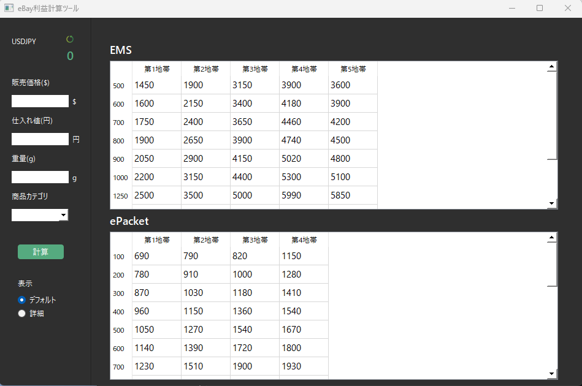

# eBayTool

ebay利益計算ツール  

## 概要

eBayでの輸出における利益を算出するための、シンプルなデスクトップGUIアプリです。  
必要最低限の情報を入力するだけで、見やすい表形式で配送地域ごとの利益を確認できます。

## 使用言語、環境

- Python3  
- PySide6

## 使い方

まず左上の更新マークをクリックして、最新のドル円為替レートを取得します。  
その後、  
  
- 販売価格($)  
- 仕入れ値(円)  
- 重量(g)  
- 商品カテゴリ(選択式)  
  
を入力して「計算」ボタンをクリックすると、配送方法ごとに地域別の利益が算出されます。

## 表示オプション

表示オプションで「詳細」を選択すると、さらに詳しい内訳を表示することができます。

### デフォルト
- 利益($)  
- 利益率(%)  
- 販売価格($)  
- 仕入れ値($)  
- 送料($)  

### 詳細
- 落札手数料($)  
- 国際決済手数料($)  
- 梱包費($)  
- 為替手数料($)  

## 対象の配送方法
- EMS  
- ePacket

## 参照
- [国際eパケット料金表](https://www.post.japanpost.jp/int/download/epacket-charges.pdf?190107)
- [EMS料金表](https://www.post.japanpost.jp/int/charge/list/ems_all.html)
